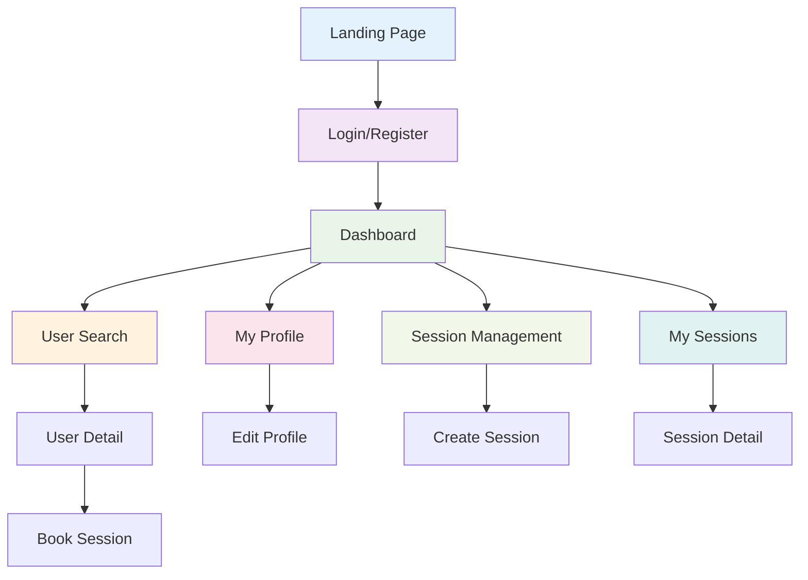

# Mentora Frontend Project Overview & Endpoints Documentation

## 🎯 Project Description

**Mentora** is a modern mentor-mentee connection platform that enables professionals to both share their expertise as mentors and learn from others as mentees. The platform operates on a simplified, lightweight model where every user can seamlessly switch between mentor and mentee roles.

### Core Concept
Similar to ADPList but with streamlined flows, Mentora focuses on making mentorship accessible and efficient. Users can register with minimal information and gradually build their professional profiles. The platform supports various session formats including one-on-one mentoring, group sessions, workshops, and Q&A sessions.

### Key User Flows

1. **Lightweight Onboarding**
   - Quick registration with email, name, and password
   - Immediate access to platform features
   - Progressive profile completion

2. **Dual Role System**
   - Every user can be both mentor and mentee
   - Seamless switching between roles
   - Unified profile for both contexts

3. **Session Management**
   - Mentors create available time slots
   - Set session types, prices, and descriptions
   - Real-time session status tracking

4. **Discovery & Matching**
   - Search users by expertise, skills, and location
   - Filter by professional background
   - View detailed profiles and availability

## 📄 Page Structure & Navigation

### Primary Navigation
```
Landing Page
├── Login / Register
├── User Search (Discovery)
├── Dashboard (Home)
├── My Profile
├── Session Management
├── User Profiles (Public)
└── Logout
```

### Detailed Page Architecture

#### 1. **Landing Page** (`index.html`)
- Marketing and value proposition
- Call-to-action for registration
- Featured mentors and success stories
- Navigation to login/register

#### 2. **Authentication Pages**
- **Login** (`login.html`) - User sign-in form
- **Register** (`register.html`) - New user registration

#### 3. **Dashboard** (`dashboard.html`)
- User home base
- Overview of upcoming sessions (as mentor/mentee)
- Quick actions for profile completion
- Recent activity and notifications

#### 4. **User Search** (`search.html`)
- Discovery page for finding mentors
- Advanced filtering (skills, location, expertise)
- User cards with preview profiles
- Search results pagination

#### 5. **Profile Management**
- **My Profile** (`profile.html`) - View/edit own profile
- **User Detail** (`user-detail.html`) - View other users' profiles

#### 6. **Session Management**
- **Create Session** (`create-session.html`) - Mentor creates time slots
- **Session Detail** (`session-detail.html`) - View session information
- **My Sessions** (`my-sessions.html`) - Manage created and booked sessions

#### 7. **Utility Pages**
- **404 Error** (`404.html`) - Not found page
- **Settings** (`settings.html`) - Account settings

## 🔗 Navigation Flow Diagram



## 🔐 Authentication System

### JWT Token Management
- **Access Token**: 60-minute expiration for API calls
- **Refresh Token**: Long-lived token for session renewal
- **Auto-Refresh**: Background token renewal before expiry
- **Secure Storage**: localStorage with proper cleanup

### Authentication Flow
1. User logs in → Receives JWT tokens
2. Access token stored in localStorage
3. Every API call includes `Authorization: Bearer <token>`
4. Background refresh before token expiry
5. Logout clears all tokens

## 📊 API Endpoints Documentation

### Authentication Module (`/api/auth`)

#### **POST /api/auth/register**
**Purpose**: Create a new user account
**Authentication**: Not required
**Content-Type**: `application/json`

**Request Body**:
```json
{
  "email": "john.doe@example.com",
  "firstName": "John",
  "lastName": "Doe",
  "password": "SecurePass123!"
}
```

**Response (201 Created)**:
```json
{
  "token": "eyJhbGciOiJIUzI1NiIsInR5cCI6IkpXVCJ9...",
  "refreshToken": "eyJhbGciOiJIUzI1NiIsInR5cCI6IkpXVCJ9...",
  "expiration": "2024-01-01T12:00:00Z",
  "user": {
    "id": "a1b2c3d4-e5f6-7890-abcd-ef1234567890",
    "email": "john.doe@example.com",
    "firstName": "John",
    "lastName": "Doe",
    "bio": null,
    "profileImageUrl": null,
    "title": null,
    "company": null,
    "location": null,
    "createdAt": "2024-01-01T10:00:00Z",
    "skills": null,
    "languages": null,
    "experienceYears": 0,
    "education": null,
    "socialMedia": null
  }
}
```

**Frontend Notes**:
- Validate email format before sending
- Password minimum 8 characters
- Auto-login user after successful registration
- Store JWT tokens for immediate use

---

#### **POST /api/auth/login**
**Purpose**: Authenticate user and return JWT tokens
**Authentication**: Not required
**Content-Type**: `application/json`

**Request Body**:
```json
{
  "email": "john.doe@example.com",
  "password": "SecurePass123!"
}
```

**Response (200 OK)**:
```json
{
  "token": "eyJhbGciOiJIUzI1NiIsInR5cCI6IkpXVCJ9...",
  "refreshToken": "eyJhbGciOiJIUzI1NiIsInR5cCI6IkpXVCJ9...",
  "expiration": "2024-01-01T12:00:00Z",
  "user": {
    "id": "a1b2c3d4-e5f6-7890-abcd-ef1234567890",
    "email": "john.doe@example.com",
    "firstName": "John",
    "lastName": "Doe",
    "bio": "Senior software engineer with 10 years of experience",
    "profileImageUrl": "https://example.com/images/profiles/john-doe.jpg",
    "title": "Senior Software Engineer",
    "company": "Tech Corp",
    "location": "San Francisco, CA",
    "createdAt": "2024-01-01T10:00:00Z",
    "skills": "JavaScript, React, Node.js, Python",
    "languages": "English, Spanish",
    "experienceYears": 10,
    "education": "BS in Computer Science",
    "socialMedia": "LinkedIn: linkedin.com/in/johndoe"
  }
}
```

**Frontend Notes**:
- Display user-friendly error messages for invalid credentials
- Remember me functionality (optional)
- Redirect to dashboard after successful login

---

#### **POST /api/auth/refresh-token**
**Purpose**: Refresh JWT access token using refresh token
**Authentication**: Not required
**Content-Type**: `application/json`

**Request Body**:
```json
{
  "token": "eyJhbGciOiJIUzI1NiIsInR5cCI6IkpXVCJ9...",
  "refreshToken": "eyJhbGciOiJIUzI1NiIsInR5cCI6IkpXVCJ9..."
}
```

**Response (200 OK)**:
Same structure as login response with new tokens.

**Frontend Notes**:
- Call this endpoint 5 minutes before token expiry
- Implement automatic retry on failure
- Force logout if refresh fails

---

#### **POST /api/auth/logout**
**Purpose**: Logout user and invalidate refresh token
**Authentication**: Required
**Content-Type**: `application/json`

**Request Body**: Empty

**Response (200 OK)**:
```json
{
  "message": "Logged out successfully"
}
```

**Frontend Notes**:
- Call before clearing local tokens
- Handle network errors gracefully
- Clear all local storage data

---

#### **GET /api/auth/me**
**Purpose**: Get current authenticated user profile
**Authentication**: Required
**Headers**: `Authorization: Bearer <token>`

**Response (200 OK)**:
```json
{
  "id": "a1b2c3d4-e5f6-7890-abcd-ef1234567890",
  "email": "john.doe@example.com",
  "firstName": "John",
  "lastName": "Doe",
  "bio": "Senior software engineer with 10 years of experience",
  "profileImageUrl": "https://example.com/images/profiles/john-doe.jpg",
  "title": "Senior Software Engineer",
  "company": "Tech Corp",
  "location": "San Francisco, CA",
  "createdAt": "2024-01-01T10:00:00Z",
  "skills": "JavaScript, React, Node.js, Python",
  "languages": "English, Spanish",
  "experienceYears": 10,
  "education": "BS in Computer Science",
  "socialMedia": "LinkedIn: linkedin.com/in/johndoe"
}
```

**Frontend Notes**:
- Use for profile page population
- Call periodically to update user data
- Cache response to reduce API calls

### Session Module (`/api/session`)

#### **POST /api/session**
**Purpose**: Create a new mentoring session
**Authentication**: Required
**Content-Type**: `application/json`

**Request Body**:
```json
{
  "startAt": "2024-01-15T14:30:00Z",
  "type": "OneOnOne",
  "price": 50.00,
  "notes": "Introduction to web development basics"
}
```

**Response (201 Created)**:
```json
{
  "id": 123,
  "mentorId": "a1b2c3d4-e5f6-7890-abcd-ef1234567890",
  "startAt": "2024-01-15T14:30:00Z",
  "endAt": "2024-01-15T15:30:00Z",
  "status": "Scheduled",
  "type": "OneOnOne",
  "price": 50.00,
  "notes": "Introduction to web development basics"
}
```

**Session Types**:
- `OneOnOne` - One-on-one mentoring session
- `Group` - Group mentoring session
- `Workshop` - Workshop session
- `QandA` - Question and Answer session

**Frontend Notes**:
- Convert local time to UTC before sending
- Show price with proper currency formatting
- Validate startAt is in the future

---

#### **GET /api/session/{id}**
**Purpose**: Get session by ID
**Authentication**: Not required
**URL Parameters**: `id` (integer)

**Response (200 OK)**:
Same as create session response.

**Frontend Notes**:
- Use for session detail pages
- No authentication required (public sessions)
- Handle 404 errors gracefully

---

#### **PUT /api/session/{id}**
**Purpose**: Update session details
**Authentication**: Required
**URL Parameters**: `id` (integer)
**Content-Type**: `application/json`

**Request Body**: Same as create session request

**Response (200 OK)**:
Same as create session response with updated data.

**Frontend Notes**:
- Only session owner can update
- Include all fields in request (PUT semantics)
- Show loading state during update

---

#### **DELETE /api/session/{id}**
**Purpose**: Delete a session
**Authentication**: Required
**URL Parameters**: `id` (integer)

**Response (200 OK)**:
```json
{
  "message": "Session deleted successfully"
}
```

**Frontend Notes**:
- Show confirmation dialog before delete
- Only session owner can delete
- Update UI immediately after success

### User Module (`/api/user`)

#### **GET /api/user/{id}**
**Purpose**: Get user by ID
**Authentication**: Required
**URL Parameters**: `id` (string)

**Response (200 OK)**:
```json
{
  "id": "a1b2c3d4-e5f6-7890-abcd-ef1234567890",
  "email": "john.doe@example.com",
  "firstName": "John",
  "lastName": "Doe",
  "bio": "Senior software engineer with 10 years of experience",
  "profileImageUrl": "https://example.com/images/profiles/john-doe.jpg",
  "title": "Senior Software Engineer",
  "company": "Tech Corp",
  "location": "San Francisco, CA",
  "createdAt": "2024-01-01T10:00:00Z",
  "updatedAt": "2024-01-15T14:30:00Z",
  "skills": "JavaScript, React, Node.js, Python",
  "languages": "English, Spanish",
  "experienceYears": 10,
  "education": "BS in Computer Science",
  "socialMedia": "LinkedIn: linkedin.com/in/johndoe",
  "mentorSessions": [],
  "mentorBookings": [],
  "menteeBookings": []
}
```

**Frontend Notes**:
- Use for public profile pages
- Includes session relationships
- Format skills as badges/tags

---

#### **GET /api/user/me**
**Purpose**: Get current user's complete profile
**Authentication**: Required

**Response (200 OK)**:
Same as get user by ID, but for current authenticated user.

**Frontend Notes**:
- Use for profile editing page
- Contains navigation properties
- Most comprehensive user data

---

#### **PUT /api/user/profile**
**Purpose**: Update current user's profile
**Authentication**: Required
**Content-Type**: `multipart/form-data` or `application/json`

**Request Body (JSON)**:
```json
{
  "firstName": "John",
  "lastName": "Doe",
  "bio": "Senior software engineer with 10 years of experience",
  "title": "Senior Software Engineer",
  "company": "Tech Corp",
  "location": "San Francisco, CA",
  "skills": "JavaScript, React, Node.js, Python",
  "languages": "English, Spanish",
  "experienceYears": 10,
  "education": "BS in Computer Science",
  "socialMedia": "LinkedIn: linkedin.com/in/johndoe"
}
```

**Request Body (Multipart Form)**:
```
firstName: John
lastName: Doe
bio: Senior software engineer with 10 years of experience
profileImage: [binary file data]
```

**Response (200 OK)**:
```json
{
  "id": "a1b2c3d4-e5f6-7890-abcd-ef1234567890",
  "email": "john.doe@example.com",
  "firstName": "John",
  "lastName": "Doe",
  "bio": "Senior software engineer with 10 years of experience",
  "profileImageUrl": "https://example.com/images/profiles/john-doe.jpg",
  "title": "Senior Software Engineer",
  "company": "Tech Corp",
  "location": "San Francisco, CA",
  "skills": "JavaScript, React, Node.js, Python",
  "languages": "English, Spanish",
  "experienceYears": 10,
  "education": "BS in Computer Science",
  "socialMedia": "LinkedIn: linkedin.com/in/johndoe",
  "createdAt": "2024-01-01T10:00:00Z",
  "updatedAt": "2024-01-15T14:30:00Z"
}
```

**Frontend Notes**:
- Use FormData for image uploads
- Show upload progress indicator
- Validate image format and size
- Preview image before upload

---

#### **GET /api/user/search**
**Purpose**: Search users with filters
**Authentication**: Not required

**Query Parameters**:
- `query` (string) - Search query for name, bio, or title
- `skills` (string) - Filter by skills (comma-separated)
- `location` (string) - Filter by location

**Example**:
```
GET /api/user/search?query=software%20engineer&skills=JavaScript,React&location=San%20Francisco
```

**Response (200 OK)**:
```json
{
  "users": [
    {
      "id": "a1b2c3d4-e5f6-7890-abcd-ef1234567890",
      "email": "john.doe@example.com",
      "firstName": "John",
      "lastName": "Doe",
      "bio": "Senior software engineer with 10 years of experience",
      "profileImageUrl": "https://example.com/images/profiles/john-doe.jpg",
      "title": "Senior Software Engineer",
      "company": "Tech Corp",
      "location": "San Francisco, CA",
      "createdAt": "2024-01-01T10:00:00Z",
      "updatedAt": "2024-01-15T14:30:00Z",
      "skills": "JavaScript, React, Node.js, Python",
      "languages": "English, Spanish",
      "experienceYears": 10,
      "education": "BS in Computer Science",
      "socialMedia": "LinkedIn: linkedin.com/in/johndoe",
      "mentorSessions": [],
      "mentorBookings": [],
      "menteeBookings": []
    }
  ],
  "totalCount": 25
}
```

**Frontend Notes**:
- Implement debounced search input
- Parse skills string into individual tags
- Show total count for pagination
- Use URL parameters for bookmarkable searches

## 🎨 Design System & UI Requirements

### Color Palette (Blue-Gray Theme)
- **Primary**: `#3b82f6` (Blue 500)
- **Primary Dark**: `#1d4ed8` (Blue 700)
- **Primary Light**: `#93c5fd` (Blue 300)
- **Secondary**: `#6b7280` (Gray 500)
- **Background**: `#f8fafc` (Slate 50)
- **Surface**: `#ffffff` (White)
- **Text Primary**: `#1e293b` (Slate 800)
- **Text Secondary**: `#64748b` (Slate 500)
- **Success**: `#10b981` (Emerald 500)
- **Error**: `#ef4444` (Red 500)
- **Warning**: `#f59e0b` (Amber 500)

### Typography
- **Headings**: Inter or system font stack, weight 600-700
- **Body**: Inter or system font stack, weight 400
- **Small**: Inter or system font stack, weight 400

### Components Pattern
- **Cards**: Rounded corners, subtle shadows, hover effects
- **Buttons**: Consistent sizing, primary/secondary variants
- **Forms**: Clean inputs with floating labels
- **Navigation**: Top bar with user dropdown
- **Notifications**: Toast messages with auto-dismiss

### Responsive Design
- **Mobile**: 320px and up (single column)
- **Tablet**: 768px and up (two columns)
- **Desktop**: 1024px and up (full layout)

## 🚀 Technical Implementation Notes

### JavaScript Architecture
- **Modules**: ES6 modules with clear separation
- **State Management**: Simple state management with localStorage
- **API Layer**: Centralized API client with interceptors
- **Form Validation**: Client-side validation with visual feedback
- **Error Handling**: Global error boundaries and user-friendly messages

### Performance Considerations
- **Image Optimization**: Lazy loading, WebP support
- **Code Splitting**: Separate bundles per page
- **Caching**: API response caching with TTL
- **Bundle Size**: Tree shaking, minification

### Accessibility
- **Semantic HTML**: Proper heading hierarchy, form labels
- **Keyboard Navigation**: Tab order, focus management
- **Screen Readers**: ARIA labels, alt text
- **Color Contrast**: WCAG AA compliance

This comprehensive documentation provides the foundation for building a modern, user-friendly frontend that fully leverages the Mentora API capabilities while maintaining clean code structure and excellent user experience.